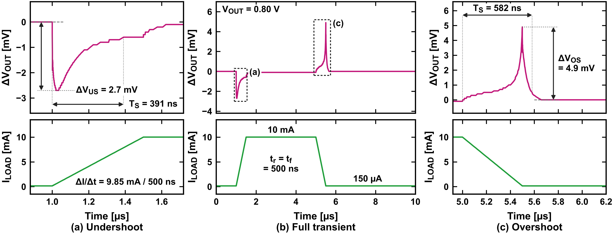
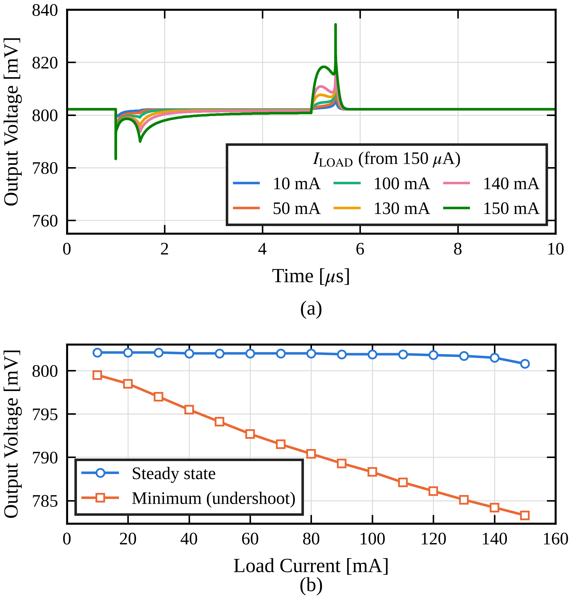
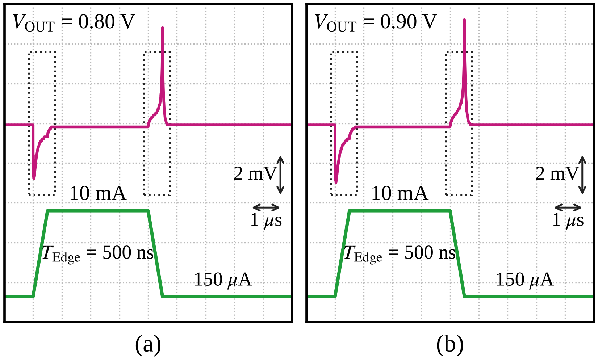
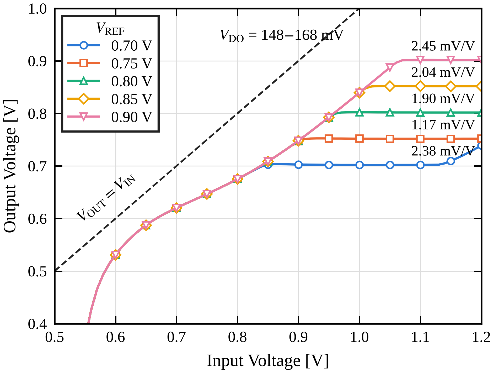
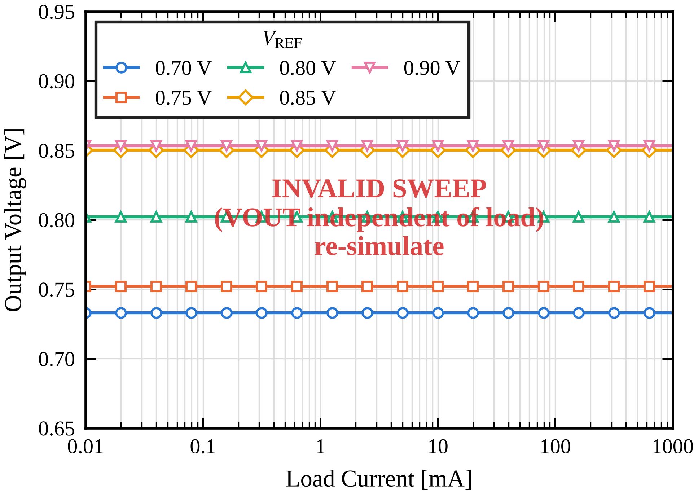
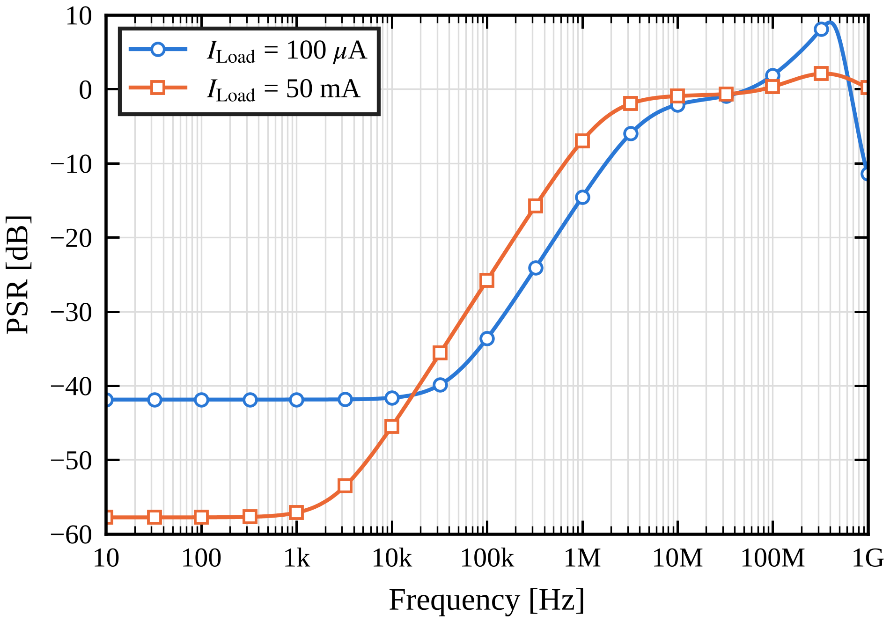
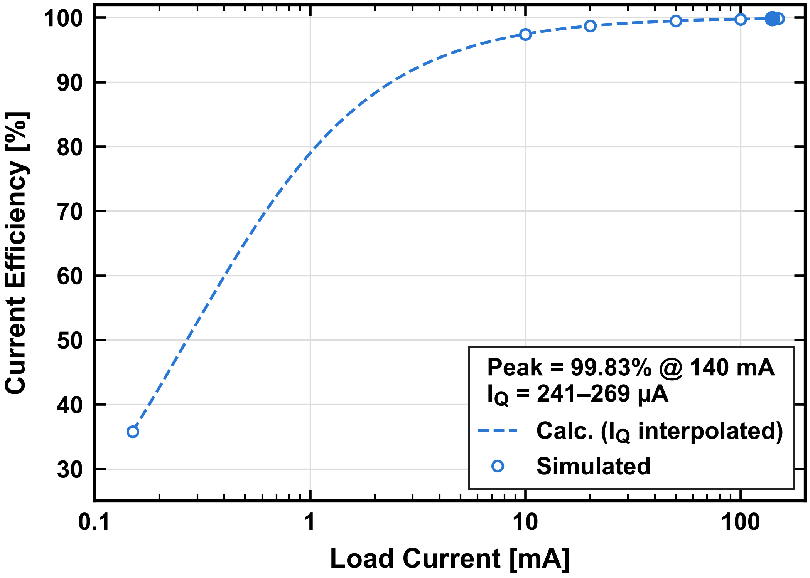
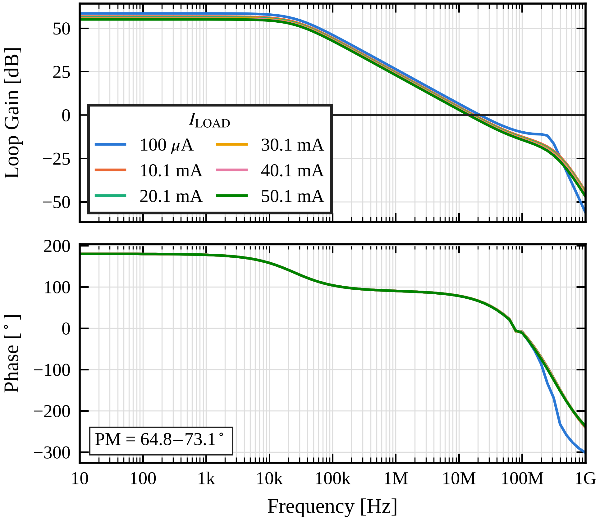
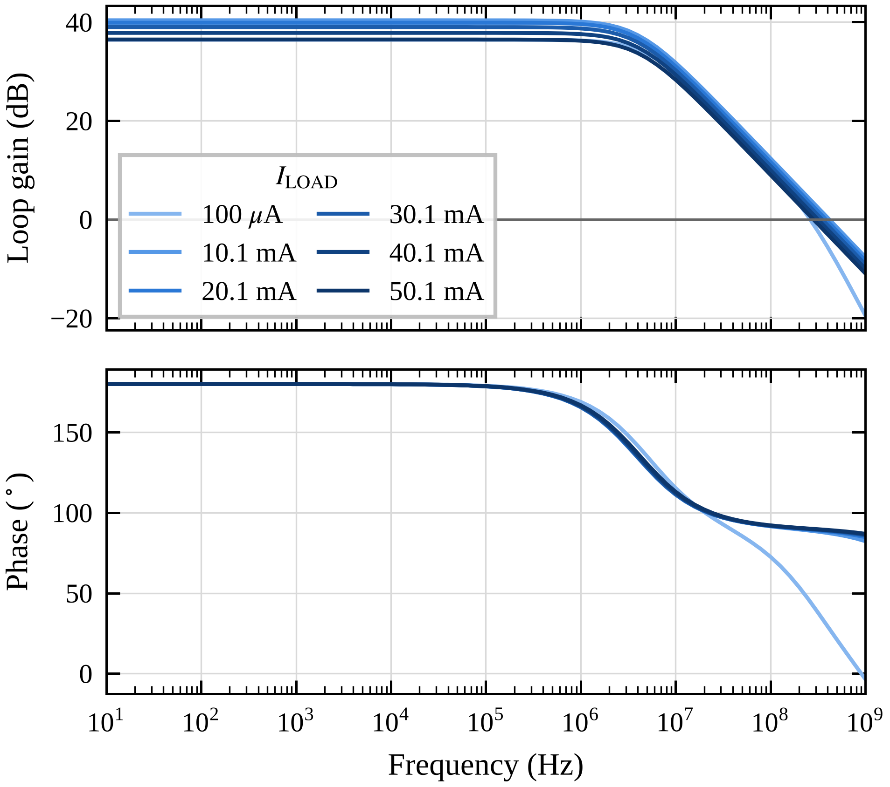

<div align="center">

# ⚡ FVF-Based LDO Regulator

**Flipped Voltage Follower(FVF) 구조의 Low-Dropout 레귤레이터 설계 · 시뮬레이션 · 논문용 Figure 자동화**


</div>

<p align="center">
  
  <br><sub><b>Load transient</b> — I<sub>LOAD</sub> 150 µA ↔ 10 mA (500 ns edge)에서 undershoot 2.7 mV / overshoot 4.9 mV</sub>
</p>

---

## 📌 Overview

FVF 기반 LDO는 출력단 자체가 국부 피드백 루프(fast loop)를 형성해 **낮은 출력 임피던스와 빠른 부하 과도 응답**을 얻는 구조입니다.
이 저장소는 28 nm CMOS 공정에서 설계한 FVF LDO의 HSPICE 시뮬레이션 결과(WaveView CSV)를 바탕으로,

- 🔍 **핵심 성능 지표를 자동 추출**하고 (dropout, LNR/LDR, PSR, settling time, UGF/PM, current efficiency …)
- 📈 **IEEE 저널 스타일 Figure**(single/double column, 벡터 PDF + 600 dpi PNG)를 한 번에 생성합니다.

## 🏆 Key Results  <sub>(V<sub>REF</sub> = 0.8 V)</sub>

| 항목 | 결과 | 조건 |
|---|---|---|
| **Max load current** | **140 mA** | 정상상태 ΔV<sub>OUT</sub> ≤ 1 mV |
| **Dropout voltage** | **160 mV** | V<sub>OUT</sub> = 0.80 V |
| **Undershoot / Overshoot** | **2.7 mV / 4.9 mV** | 150 µA ↔ 10 mA, t<sub>r</sub> = t<sub>f</sub> = 500 ns |
| **Settling time** | 391 ns / 582 ns | ±0.5 mV 이내 |
| **Line regulation** | 1.9 mV/V | V<sub>IN</sub> 1.0 – 1.2 V |
| **Load regulation** | 3.6 µV/mA | 0.2 – 50 mA, V<sub>IN</sub> = 1.0 V |
| **PSR @ DC** | −41.9 dB / **−57.8 dB** | I<sub>LOAD</sub> = 100 µA / 50 mA |
| **Quiescent current** | ≈ 260 µA | |
| **Current efficiency** | **99.83 %** | I<sub>LOAD</sub> = 140 mA |
| **Overall loop** | UGF 14.2 – 21.5 MHz, PM 64.8° – 73.1° | I<sub>LOAD</sub> 100 µA – 50 mA |
| **Fast (FVF) loop** | UGF 261 – 417 MHz, PM 45° – 90° | I<sub>LOAD</sub> 100 µA – 50 mA |

> 전체 수치는 [`figures/metrics.txt`](figures/metrics.txt), [`figures/summary.json`](figures/summary.json)에 정리되어 있습니다.

## 📊 Figures

<table>
  <tr>
    <td width="50%"><p align="center"><sub><b>Fig. 1</b> 최대 부하 전류 (150 µA → 10 – 150 mA)</sub></p></td>
    <td width="50%"><p align="center"><sub><b>Fig. 5</b> Load transient (V<sub>OUT</sub> = 0.8 / 0.9 V)</sub></p></td>
  </tr>
  <tr>
    <td><p align="center"><sub><b>Fig. 2</b> Line regulation · dropout (V<sub>REF</sub> 0.70 – 0.90 V)</sub></p></td>
    <td><p align="center"><sub><b>Fig. 3</b> Load regulation</sub></p></td>
  </tr>
  <tr>
    <td><p align="center"><sub><b>Fig. 4</b> PSR (100 µA / 50 mA / 140 mA)</sub></p></td>
    <td><p align="center"><sub><b>Fig. 7</b> Current efficiency</sub></p></td>
  </tr>
  <tr>
    <td><p align="center"><sub><b>Fig. 8a</b> Overall loop gain / phase</sub></p></td>
    <td><p align="center"><sub><b>Fig. 8b</b> Fast (FVF) loop gain / phase</sub></p></td>
  </tr>
</table>

## 🗂️ Repository Structure

```
FVF-LDO/
├── data/                 # HSPICE → WaveView CSV exports
├── sim/loadreg_dc.sp     # load regulation / IQ DC-sweep deck
├── scripts/ldo_figures.py  # 지표 추출 + Figure 생성 (단일 스크립트)
└── figures/              # PDF(vector) · PNG(600 dpi) · metrics.txt · summary.json
```

<details>
<summary><b>🔧 Reproduce & figure details</b></summary>

<br>

```bash
pip install numpy matplotlib
python scripts/ldo_figures.py
```

`data/`의 WaveView CSV를 읽어 IEEE single-column(3.5 in; fig6은 double-column 7.16 in) Figure를 `figures/`에 PDF(vector, 폰트 임베드)와 PNG(600 dpi)로 저장합니다.
추출한 수치(undershoot, dropout, PSR, Iq, UGF/PM …)는 `figures/metrics.txt`와 `figures/summary.json`에 기록됩니다.
폰트는 JSSC 레퍼런스 Figure와 같은 bold Arial이며, Arial이 없으면 경고와 함께 Liberation Sans를 사용합니다.

| Figure | Source | Content |
|---|---|---|
| fig1_max_load | maxload1.csv | (a) VOUT for load steps 150 µA → 10–150 mA, (b) steady-state / minimum VOUT vs ILOAD |
| fig2_line_regulation | linR1.csv | VOUT vs VIN, VREF = 0.70–0.90 V (zoomed: VIN ≥ 0.8 V), LNR, V_DO |
| fig3_load_regulation | loadR1.csv (DC sweep, `sim/loadreg_dc.sp`) | VOUT vs ILOAD per VREF on a linear axis from 0.2 mA, LDR = ΔVOUT/ΔILOAD over 0.2–50 mA |
| fig4_psr | psr1.csv | PSR at ILOAD = 100 µA, 50 mA and 140 mA (max load), plotted to 100 MHz |
| fig5_transient | tr1.csv | VOUT (0.8 V / 0.9 V) and ILOAD, 150 µA ↔ 10 mA |
| fig6_transient_zoom | tr1.csv | zoom on rising (a) and falling (b) load steps |
| fig7_current_efficiency | iq1.csv (DC sweep, preferred) or eff1.csv | current efficiency vs ILOAD |
| fig8a_stability_overall_loop | stb1.csv | overall loop gain & phase vs ILOAD (phase column was exported as 20·log10(\|phase\|); the script undoes it) |
| fig8b_stability_fast_loop | f_stb1.csv | fast (FVF) loop gain & phase vs ILOAD |

</details>

---

<div align="center">
<sub>Made by <a href="https://github.com/youngwan12">@youngwan12</a></sub>
</div>
